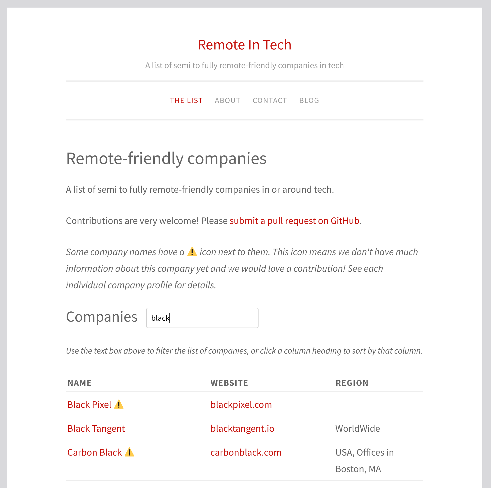

When I first got involved with the maintenance of this list of remote-friendly companies, it was just a GitHub repository with content stored in a bunch of Markdown files.  This is great for developers, but GitHub can be a bit intimidating if you haven't used it before.

Then, about a month ago, this website got a new [homepage](https://remoteintech.company/) and new [company profile pages](https://remoteintech.company/automattic/) which are much easier for everyone to use and navigate.  In this post I'll share a bit about the process of creating and testing this **static site generator** and taking it live.

<!--more-->

This project started with [discussion](https://github.com/remoteintech/remote-jobs/issues/44) about a GitHub Pages site and how to best store the data needed for the site.  Lots of ideas were put out there, including storing every piece of information about each company in JSON files.

I didn't like this approach because it would make the maintenance of the list more difficult.  We'd like anyone who has a GitHub account to be able to make changes to their company's profile.  This was already working well before, because the list and the company profiles were just a bunch of Markdown files.

So, I [decided](https://github.com/remoteintech/remote-jobs/issues/44#issuecomment-334347345) to keep this structure, and enhance it until we could turn it into a live website.  I [started](https://github.com/remoteintech/remote-jobs/pull/375) by writing a Node.js script to **parse and validate** the data for all companies, and then got this validation [running](https://github.com/remoteintech/remote-jobs/pull/377) [automatically](https://github.com/remoteintech/remote-jobs/pull/378) against all pull requests using [Travis CI](https://en.wikipedia.org/wiki/Travis_CI).

Travis CI is great because it allows developers to verify our code (and in this case, data) automatically, making sure we aren't breaking anything with a given change.  It's not the easiest thing to use, though, because when a build fails, you need to go and read through its log, which usually looks a lot like this:

Often, this leads to a contributor starting a pull request and then not finishing it because it's not easy to understand what went wrong.

To make this process easier, I [wrote a bot](https://github.com/remoteintech/remote-jobs/pull/382) that leaves comments directly on a pull request if there are any issues with the changes:

This is a big help for contributors and maintainers both.  Contributors get immediate feedback and understand exactly what they need to change, and maintainers have much of their review work done for them, with a clear record of what happened and why.

Of course, this sort of system works best for projects where the code is well-understood and the tests are reliable and fast.  Otherwise the results can be a bit unpredictable.  However, I'm quite happy with how this experiment has turned out so far:  it's a nice way to improve the usability of some industry-standard but very developer-oriented tools, and I think there is room to apply the same technique to a lot of other projects.

Anyway, back to the static site generator.

I [continued](https://github.com/remoteintech/remote-jobs/pulls?utf8=%E2%9C%93&q=is%3Apr+author%3Anylen+created%3A2018-04-01..2018-06-24) expanding the data validation script (and the bot messages) until I felt like I had tested almost every possible mistake that could exist in the company list data or the validation code.  At this point I was ready to create the long-discussed front-end site.

First, I [refactored](https://github.com/remoteintech/remote-jobs/pull/444) the validation script to split most of its logic into a separate file that could be re-used by a static site generator.  Refactoring is often messy, with a risk of breaking the code, but this time it was pretty easy because I had already written thorough automated tests.

Then, I [modified](https://github.com/remoteintech/remote-jobs/pull/445) the validation code to parse and return all of the data for the company list, instead of just validating that the data is OK.

Finally, with all of the logic and data in place, it was time to [build the site](https://github.com/remoteintech/remote-jobs/pull/460).

Since the blog section of the website already existed (hosted here on the excellent WordPress.com), I decided to use the same template and style for the company list and the company profile pages.  I started by saving an HTML file from here on the blog, trimmed out the unnecessary bits, and turned the rest into a [template file](http://node-swig.github.io/swig-templates/).  Then I wrote code to build static HTML pages using the data from the company list and all of the company profiles.

We're using the excellent [Netlify](https://www.netlify.com/) to deploy and host this portion of the site.  It automatically builds and deploys a new version of the site with every change merged to GitHub.

The result is what you can see today on this site's homepage:

If you're already familiar with static site generators, you might be wondering:  **why didn't we just use GitHub Pages?**

Well, we did, for a little while, but I found it pretty difficult to customize the design of the resulting site.  Also, GitHub Pages works best for sites that have a one-to-one mapping between a Markdown file and a page.  This is not completely true (we display some extra information on company profiles).  A static site generator is not a very complicated piece of code, so I decided to write one for this specific task.

In the future we'd also like to add some smarter filtering to the company list, for example the ability to say "[show me all the companies that work with React.js](https://github.com/remoteintech/remote-jobs/issues/464)".

In order to make this work, we'll need to add more validation of what people have actually entered in the **Company technologies** section for each company, and then pull this data from each company profile into the main company list.  This is exactly the sort of thing that the current code is set up to allow, but it would be pretty difficult to achieve with GitHub Pages.

This kind of **enhanced filtering** is something we'd love to have on the site, but since this is a volunteer project, time is limited.  If you'd like to help, we'd love to have you!  You can start by having a look at our [open issues on GitHub](https://github.com/remoteintech/remote-jobs/issues) and picking one that interests you, or by making a new suggestion there or in the comments below.