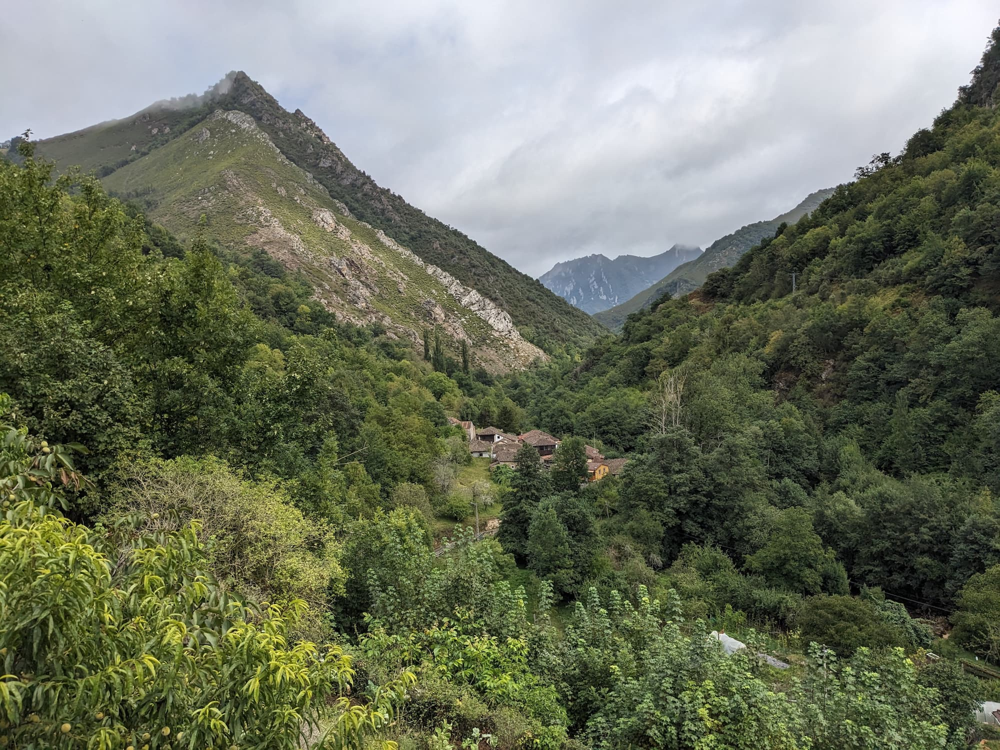

Using the powerful Eleventy Image plugin, we have three ways to optimize images: HTML Transform, Markdown syntax, and a Nunjucks shortcode.

## HTML Transform

Transforms any `` or `<picture>` tags in HTML files as a post-processing step. Find the default settings directly in `eleventy.config.js`.

```html


```

We can pass in overrides for every instance and use attributes. By default all images are set to be lazy loaded, but we can override this by directly setting `loading="eager"` and `decoding="sync" `on the `` element.

Another thing to note is the  `widths: ['auto']` setting, which by default only includes the original size image. You can set the dedicated `widths` to be used by adding `eleventy:widths="800,1200"` on the element. For images with [Markdown syntax](/blog/post-with-an-image/#markdown-syntax), I set fixed `widths` so we don't need to set a value on every instance.

`sizes` defaults to `auto`, which is applied to all lazy loading images. For eager-loading images, the value is equivalent to `100vw` See: https://github.com/whatwg/html/pull/8008. We can _still_ overwrite this, by setting the `sizes` attribute directly on the `` element, with something specific like `sizes="(max-width: 615px) 50vw, 100vw"`.

```html

```



This makes this syntax equally powerfull as the [shortcode](/blog/post-with-an-image/#nunjucks-shortcode), and easier to read - with the extra benefit that we can use both relative and absolute image sources.
Only "downside" ist, that it comes with a higher build cost due to the post-processing step.

More info: https://www.11ty.dev/docs/plugins/image/#html-transform

## Markdown syntax

This also uses [Image HTML Transform ](https://www.11ty.dev/docs/plugins/image/#html-transform).
The markdown sytnax for images creates the `` element the plugin is looking for, and then transforms it to the `<picture>` element (if more than one format is set).

In `src/_config/plugins/markdown.js` I customized the Markdown rendering for images slightly. What normally would become a `title` attribute is used to create a caption. Note that I set a fixed `widths` value instead of `auto` as the default.

```markdown

 'I used a portrait lens for this one'
```


You can also add custom attributes here ([Kudos to Aleksandr](https://www.aleksandrhovhannisyan.com/blog/eleventy-image-transform/)), to overwrite the default `widths`, have the image eagerly loaded, or add a class etc.

```markdown
{attrs}
{loading="eager" decoding="sync" eleventy:widths="400" class="grayscale"}
```

{loading="eager" decoding="sync" eleventy:widths="400" class="grayscale"}

## Nunjucks shortcode

The most basic version contains the path to the image (absolute) and alt text (can be an empty string if the image is decorative).



```jinja2

```



It defaults to `loading = 'lazy'`, the picture element gets its set of images from `widths=[650,960,1400]` and compares to a condition of `sizes="auto"`.
You can pass in manually all the conditions, add `null` to skip. The arguments include classes for the outer container ( `<picture>` or `<figure>` element), and for the `` element.

The shortcode is stored in `src/_config/shortcodes/image.js`.



```jinja2


```





Example: predefine `widths` and `sizes` using Nunjuck's `set` tag or front matter fields, and dynamically get the image path, like I do in the built-with template.



```jinja2

```



## Comparing Shortcode and HTML Transform

The shortcode can be much terser than the HTML syntax. It also includes the `slot="image"` attribute for seamless WebC component integration. However, it's less readable, and you must carefully order all arguments. On the other hand, the HTML syntax is much more readable and easier to maintain.

As for the higher build cost of post-processing, the shortcode images are being skipped using the `eleventy:ignore` attribute, but still seem to be processed somehow. I have yet to figure out if this is avoidable. If you set the `eleventy:ignore` on an HTML image though, it _is_ completely skipped and excluded from the processed images.

**These two approaches produce (almost) the same output:**



```jinja2


<figure class="feature">
  
  
  <figcaption>{{ credit }}</figcaption>
  
</figure>

```





<figure class="feature">
  
  
  <figcaption>{{ credit }}</figcaption>
  
</figure>


More:
- https://www.11ty.dev/docs/plugins/image/
- https://www.youtube.com/watch?v=e0OHgC677ec
- https://www.aleksandrhovhannisyan.com/blog/eleventy-image-transform/
- https://coryd.dev/posts/2024/setting-up-image-transforms-in-eleventy


  

